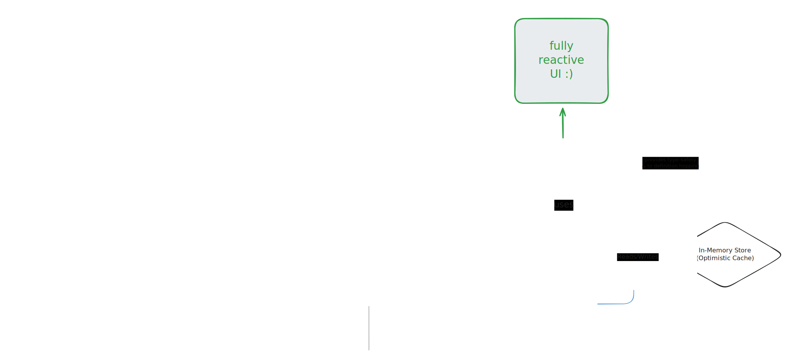

# Convex-Lite


An open-source, self-hostable full-stack framework inspired by the developer experience of [Convex](https://convex.dev). It provides end-to-end typesafety and real-time updates on a standard Node.js and Drizzle ORM stack.

---

## Table of Contents

- [Architecture at a Glance](#architecture-at-a-glance)
- [Key Design Choices](#key-design-choices)
- [Core Features](#core-features)
- [Getting Started](#getting-started)
- [Defining API Endpoints](#defining-api-endpoints)
- [Using The Hooks in React](#using-the-hooks-in-react)
- [Architecture & Scalability FAQ](#architecture--scalability-faq)
- [Future Work](#future-work)
- [License](#license)

---

## Architecture at a Glance

This diagram provides a high-level overview of the data flow and key components within the Convex-Lite framework.



---

## Key Design Choices

Convex-Lite is built on a few core principles that offer a different set of trade-offs compared to managed platforms.

* **Self-Hosted & Simple:** Runs on a standard Node.js server, giving you direct control over your deployment environment. This can simplify debugging and provides clear, predictable performance compared to some serverless platforms.

* **Integration with Standard Tooling:** Leverages popular, battle-tested libraries like Drizzle ORM for database access and Zod for validation, allowing developers to use familiar and powerful tools.

* **Explicit Data Invalidation:** The real-time system uses a typesafe, explicit invalidation mechanism (`scheduler.invalidate(...)`). This makes the data flow between mutations and queries clear and easy to reason about.

* **No Tooling Lock-in:** While Convex can be self-hosted, its ecosystem relies on a proprietary ORM and validation library. By using standard libraries like Drizzle and Zod, this project avoids locking you into a specific set of data tools, offering greater flexibility.

---

## Core Features

-   **🚀 End-to-End Typesafety:** Automatically generate types from your server-side API functions. "Go to Definition" in VS Code works out of the box, taking you straight to your backend implementation.
-   **⚡️ Optimistic Updates & Real-time Reactivity:** UI updates are instant. Mutations can optimistically update a client-side cache, which then gets seamlessly reconciled with the server state.
-   **🛡️ Runtime Validation with Zod:** Define argument schemas for your API endpoints using Zod. The server automatically validates incoming requests, making your handlers cleaner and more secure.
-   **📦 Database Agnostic:** Built on **Drizzle ORM**. Start with zero-config SQLite and easily switch to PostgreSQL or MySQL when you're ready to scale.
-   **👾 DX-Focused:** A single `pnpm dev` command starts the entire development environment, with automatic code generation and server restarts on file changes.

---

## Getting Started

1.  **Clone & Install:**
    ```bash
    git clone https://github.com/vucinatim/convex-lite.git
    cd convex-lite
    pnpm install
    ```

2.  **Run Development Environment:**
    This single command starts the Vite client, generates the initial API types, and starts the `nodemon`-powered backend server.
    ```bash
    pnpm dev
    ```

3.  **Start Coding:**
    Create a new `.ts` file anywhere inside the `convex/` directory (e.g., `convex/tasks.ts`) and start defining your queries and mutations. The watcher will automatically regenerate types and restart the server every time you save.

---

## Defining API Endpoints

Your backend logic lives inside the `convex/` directory.

### Queries

A query is a read-only function that fetches data. It can accept arguments validated by a Zod schema.

**Example: `convex/messages.ts`**
```typescript
import { query } from "convex/lib/server";
import { z } from "zod";

export const listByChannel = query({
  args: z.object({
    channel: z.string(),
  }),
  handler: async ({ db }, { channel }) => {
    // Your Drizzle logic here.
    // The `channel` argument is fully typed and validated.
    return db.query.messages.findMany({
      where: (messages, { eq }) => eq(messages.channel, channel),
      orderBy: (messages, { asc }) => asc(messages.createdAt),
    });
  },
});
```

### Mutations

A mutation modifies data and can invalidate queries to trigger real-time updates on all connected clients.

**Example: `convex/messages.ts`**
```typescript
import { mutation, query } from "convex/lib/server";
import { z } from "zod";

// Assume listByChannel is defined above
export const send = mutation({
  args: z.object({
    channel: z.string(),
    text: z.string(),
  }),
  handler: async ({ db, scheduler }, { channel, text }) => {
    await db.insert(tables.messages).values({ channel, text, /*...*/ });

    // This is typesafe! Invalidate queries that need to be refetched.
    await scheduler.invalidate(listByChannel);
  },
});
```

---

## Using The Hooks in React

### `useQuery`

Subscribes to a query's data. The component will automatically re-render when the data changes or is invalidated.

```tsx
import { useQuery } from "hooks/use-convex-lite";
import { api } from "convex/_generated/api";

function MessageList({ channel }: { channel: string }) {
  // `useQuery` for a function with arguments.
  const { data: messages, isLoading } = useQuery(
    api.messages.listByChannel,
    { channel }
  );

  if (isLoading) return <div>Loading messages...</div>;
  // ... render messages
}
```

### `useMutation` & Optimistic Updates

Provides a `mutate` function and allows you to chain `.withOptimisticUpdate` to make your UI feel instantaneous.

```tsx
import { useMutation } from "hooks/use-convex-lite";
import { api } from "convex/_generated/api";

function SendMessageForm({ channel }: { channel: string }) {
  const { mutate: sendMessage } = useMutation(api.messages.send)
    .withOptimisticUpdate((localStore, args) => {
      // 1. Get the current data from the cache
      const currentMessages = localStore.getQuery(
        api.messages.listByChannel, 
        { channel: args.channel }
      );
      if (!currentMessages) return;

      // 2. Create the "fake" new message
      const optimisticMessage = {
        _id: `temp_${Date.now()}`,
        text: args.text,
        channel: args.channel,
        // ...
      };

      // 3. Write the new state back to the cache
      localStore.setQuery(
        api.messages.listByChannel,
        { channel: args.channel },
        [...currentMessages, optimisticMessage]
      );
    });
  
  // ... form logic to call `sendMessage({ channel, text })`
}
```

---

## Architecture & Scalability FAQ

#### Q: Is the framework tied to a specific database?

**No, it is highly database agnostic.** Thanks to Drizzle ORM, your application logic is decoupled from the database. Switching from SQLite to PostgreSQL requires changing only your database connection file (`server/lib/database.ts`). Your query and mutation handlers remain untouched.

#### Q: How do I handle database schema changes and migrations?

**This is a major advantage of using Drizzle ORM.** You can use Drizzle's official command-line tool, drizzle-kit, to automatically generate SQL migration files based on changes you make to your convex/schema.ts.

The typical workflow is very straightforward:

1. Modify your schema in convex/schema.ts (e.g., add a new table or a column).
2. Run a command like `pnpm drizzle-kit generate` in your terminal. drizzle-kit will compare your new schema to the old state and create a new SQL migration file.
3. Apply the migration to your database using `pnpm drizzle-kit push` (for prototyping) or by running the generated SQL file (for production).

#### Q: How does this scale?

The single-node setup is very powerful, but it is not horizontally scalable out of the box. The primary bottleneck is the in-memory WebSocket connection manager. To scale beyond a single server, you would need to introduce a Pub/Sub message broker like **Redis** to handle broadcasting query invalidations across multiple server instances.

### Scalability Tiers

| Architecture Tier | App Server Setup | Database | Real-time Messaging | Est. Concurrent Users (Chat App) | Primary Bottleneck | Next Step to Scale |
| :--- | :--- | :--- | :--- | :--- | :--- | :--- |
| **Tier 1: Hobbyist**<br/>(The default setup) | 1x Single Instance | SQLite | In-Memory `Set` | **50 - 200** | SQLite write contention & I/O. | Migrate to a client-server database. |
| **Tier 2: Professional Single-Node**<br/>(The first big leap) | 1x Single Instance | PostgreSQL (local) | In-Memory `Set` | **500 - 2,000** | Single Node.js CPU core & memory. | Implement external messaging service. |
| **Tier 3: Scalable App Layer**<br/>(Ready for growth) | 3x+ App Cluster | PostgreSQL (local) | **Redis Pub/Sub** | **2,000 - 10,000** | Database connection limits & CPU. | Move the database to a dedicated server. |
| **Tier 4: Dedicated DB**<br/>(Production Grade) | 3x+ App Cluster | **Dedicated PostgreSQL Server** | Redis Pub/Sub | **10,000 - 50,000+** | Database performance (CPU/RAM/Disk I/O). | Implement read replicas for the database. |
| **Tier 5: Enterprise Scale**<br/>(High Availability) | Auto-scaling Cluster | **Managed / Clustered PostgreSQL** | Managed Redis | **50,000++** | Cost, network latency, application logic complexity. | Database sharding, regional distribution. |

-----

## Future Work

Convex-Lite provides a solid foundation. Here are some ideas for future improvements:
* Add first-class support for authentication and user sessions.
* Implement file storage (e.g., via S3-compatible services).
* Add support for scheduled functions (crons).
* Implement a more advanced optimistic update system that can automatically revert on mutation failure.

## License

This project is licensed under the MIT License. See the [LICENSE](LICENSE) file for more information.